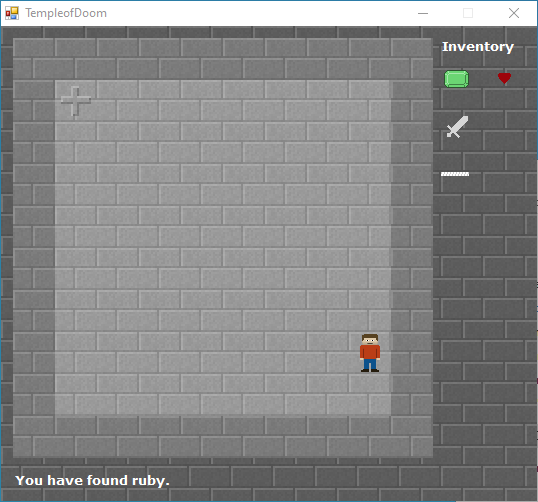
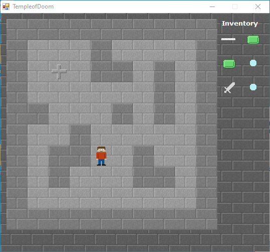
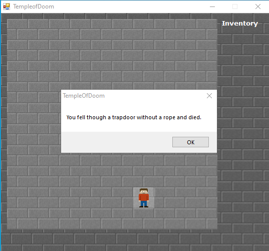

# Temple of Doom

June 6, 2012

A simple adventure game written in Visual Basic .NET as the final project for my freshman high school computer science class.

How to play:

1. Explore the temple and find all the treasures.
2. If you fall into a trap door without a rope, you die.
3. Win the game by finding the hidden lair and slaying the dragon. *Unfortunately the game seems to be missing the dragon. :(*

